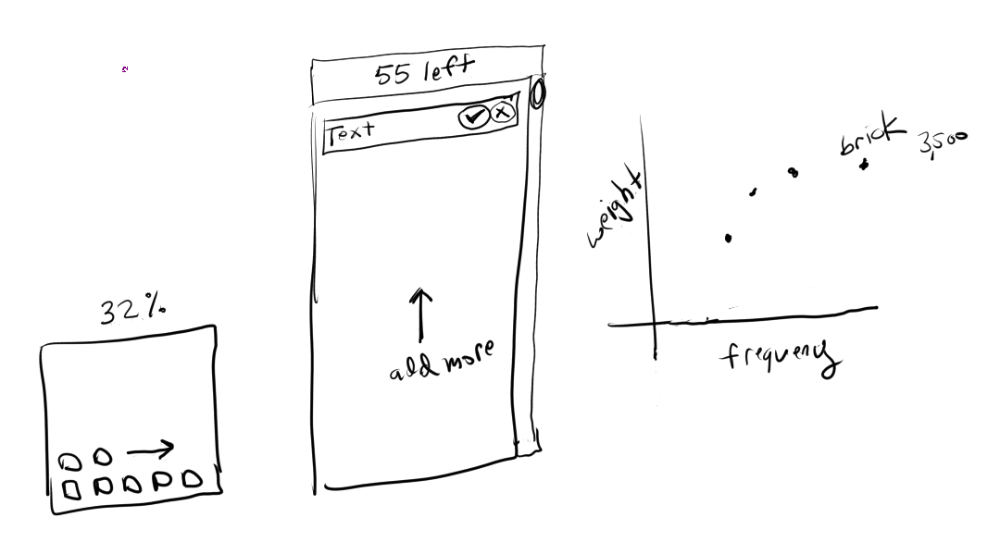
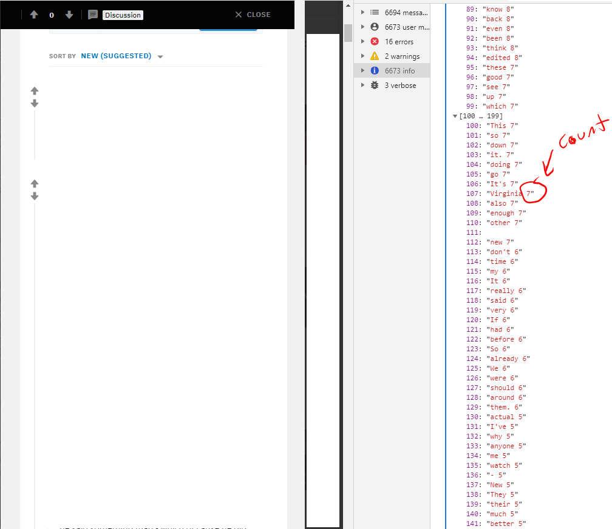

# page-summarizer
This is a project to get a word frequency count.

Ideally you can can:

1) select the target to grab(text) using something like the dom hover tool pointer(border highlighting)
2) way to specify what words are ignored
3) show the frequency on a basic scatter plot

I have not figured out what the other axis is, I have the frequency but the "importance" I don't know what to grade that on yet.

At this time the intent is a minified code blob you paste into dev tools on some page.
It should be a browser extension ideally but future work.

### 05/12/2020
Some UI thoughts of parts of the steps. Drawn with krita

### 04/18/2020
Example of current version, really bad needs to be cleaned up

